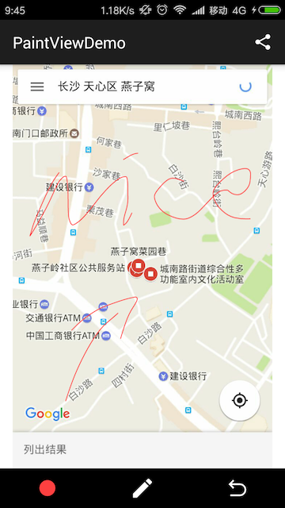

# PaintView

[中文README](res/README_CN.md)

PaintView aims to painting on image(or not) with zooming and graging surpported, and the painting result can be shared.

Click the icon to download demo apk.

## Gradle Dependency

Add this in your root build.gradle file (not your module build.gradle file):

	allprojects {
	    repositories {
	        ...
	        jcenter()
	    }
	}

Then, add the library to your module build.gradle:

	dependencies {
	    compile 'com.lht:paintview:{latest.release.version}'
	}

## Screenshot & Feature

### 1.16

* Adding Text by Code
* API for whole bitmap in original scale and transition, or just content in the view
* Zooming and Draging

### 1.0

* Background Image Setting
* Setting Color and Width of Stroke
* Undo
* Getting Painting Result

## TODO

* Text with Better Solution
* Canvas Rotation
* Boundary Limitation of Gesture
* Comment and Translation
* Eraser

## Demo Description

* Set web screenshot as background image to paint
* Share after painting
* The web screenshot bitmap can be 
transferred by Intent, but it will crash if the bitmap is too big, so the Demo transfer bitmap by saving it as a file.